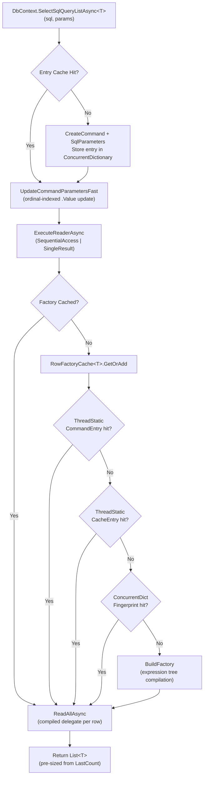

# SqlToObjectify — Architecture & Execution Flow

## How It Works

SqlToObjectify maps SQL result sets to .NET objects using **expression-tree-compiled row factories** with aggressive caching at every level. The hot path (repeated calls) avoids all reflection, all parameter creation, and all dictionary lookups.

---

## Execution Flow

### 1. Raw SQL → DTO (`SelectSqlQueryListAsync<T>`)

```
Caller passes: SQL string + Dictionary<string, object> parameters
```

**First call (cold path):**
1. `GetOrCreateEntry<T>` — cache miss → creates `DbCommand`, attaches typed `SqlParameter` objects
2. Stores normalized parameter name arrays (`@name` + `name`) for future ordinal lookups
3. `ExecuteReaderAsync` with `SequentialAccess | SingleResult`
4. `RowFactoryCache<T>.GetOrAdd` — cache miss → builds expression-tree row factory
5. `ReadAllAsync` — iterates reader, calls compiled factory per row, fills `List<T>`
6. Caches: `InternalCompiledEntry<T>` (command + factory + last count)

**Subsequent calls (hot path):**
1. `GetOrCreateEntry<T>` — cache hit → returns existing entry
2. `UpdateCommandParametersFast` — ordinal-indexed `.Value` updates (zero string ops)
3. `ExecuteReaderAsync`
4. Skips `GetOrAdd` entirely — factory already in entry
5. `ReadAllAsync` — pre-sized `List<T>` from previous count

### 2. Stored Procedure → DTO (`SelectStoredProcedureListAsync<T>`)

Identical flow to raw SQL, except:
- `CommandType = StoredProcedure` (instead of `Text`)
- Cache key includes `CommandType`, so same SP name won't collide with a text query

### 3. Compiled Query Path (`CompiledSqlQuery<T>`)

Maximum performance for repeated hot queries with changing parameter values.

**Setup (once):**
1. `CompileSqlQuery<T>(sql, paramNames)` — creates `DbCommand`, allocates parameter slots
2. No parameters attached yet — slots are lazy-created on first `SetParameter`

**Each execution:**
1. `SetParameter(index, value)` — typed overloads (int, string, etc.) set `.Value` directly
2. `ToListAsync()` / `FirstOrDefaultAsync()` — uses cached factory, pre-sized list

---

## Caching Architecture



### Cache Key Structure

| Cache | Key | Value | Scope |
|---|---|---|---|
| Entry Cache | `(DbConnection, SQL text, CommandType, typeof(T))` | `InternalCompiledEntry<T>` | Static (process lifetime) |
| RowFactory Cache | `SchemaFingerprint` (dual FNV-1a hash) | Compiled `Func<DbDataReader, T>` | Static per `T` |
| ThreadStatic CommandEntry | Command text + field count | `RowFactory` | Per-thread |
| ThreadStatic CacheEntry | `SchemaFingerprint` | `RowFactory` | Per-thread |

---

## Row Factory Compilation

The expression tree builds a lambda like:

```csharp
// Generated for PersonDto with columns: Id (int), FullName (string), Age (int), City (string)
(SqlDataReader reader) =>
{
    var obj = new PersonDto();
    obj.Id = reader.GetInt32(0);            // typed getter, no boxing
    if (!reader.IsDBNull(1))
        obj.FullName = reader.GetString(1);
    obj.Age = reader.GetInt32(2);
    if (!reader.IsDBNull(3))
        obj.City = reader.GetString(3);
    return obj;
}
```

Key optimizations in the compiled factory:
- **Typed getters** (`GetInt32`, `GetString`) instead of boxed `GetValue`
- **Constant ordinals** baked into the expression tree
- **Null checks skipped** for columns marked `AllowDBNull = false` in schema
- **Dual compilation**: one for `DbDataReader` (general), one for `SqlDataReader` (SQL Server optimized)
- **Enum support**: parsed from string or cast from numeric

---

## Performance Model

### What is cached (and when)

| Artifact | Built | Lifetime | Cost |
|---|---|---|---|
| `DbCommand` + `SqlParameter` objects | First call per (connection, SQL, type, T) | Process | ~1-5 us |
| Parameter name arrays (prefixed + unprefixed) | First call (same key) | Process | Negligible |
| `RowFactory` (compiled delegate) | First execution with a new schema fingerprint | Process | ~50-200 us (expression compile) |
| `List<T>` capacity hint (`LastCount`) | Updated after each call | Process | 0 |

### What stays on the hot path

Per repeated call, the only work is:
1. `ConcurrentDictionary.TryGetValue` — entry cache lookup (~20 ns)
2. `UpdateCommandParametersFast` — ordinal loop, `.Value = x` per param (~5 ns/param)
3. `ExecuteReaderAsync` — SQL Server round-trip (network-bound)
4. `ReadAllAsync` — one compiled delegate call per row (~2-5 ns/row overhead)
5. `List<T>.Add` — pre-sized, no reallocation

### What is NOT on the hot path

- Reflection / `PropertyInfo` lookups
- `Expression.Compile()`
- `DbCommand.CreateParameter()`
- String normalization (`"@" + key`)
- `DbParameterCollection` string-indexed lookups
- `RowFactoryCache<T>.GetOrAdd` dictionary lookup (factory stored in entry)

---

## Project Structure

```
SqlToObjectify.All.sln              # Unified solution (open this)
|
+-- SqlToObjectifyLibrary/          # Core NuGet package
|   +-- DbContextExtensions.cs      # Public API: extension methods on DbContext
|   +-- CompiledSqlQuery.cs         # Pre-compiled query wrapper
|   +-- DataReaderObjectMapper.cs   # Row factory cache + expression tree builder
|
+-- SqlToObjectify.Test/            # xUnit integration tests (LocalDB)
|   +-- Fixtures/DatabaseFixture.cs # Auto-creates DB + stored procedures
|   +-- Tests/                      # RawSql, StoredProcedure, Parameter, Cache tests
|
+-- SqlToObjectifyVsEfCoreBenchmark/ # BenchmarkDotNet comparisons
    +-- PersonQueryBenchmarks.cs     # Raw SQL: SqlToObjectify vs EF Core vs Dapper
    +-- StoredProcedureBenchmarks.cs # Stored Proc: SqlToObjectify vs EF Core vs Dapper
```

## Quick Start

```bash
# Build everything
dotnet build SqlToObjectify.All.sln

# Run tests (requires SQL Server LocalDB)
dotnet test SqlToObjectify.Test/SqlToObjectify.Test.csproj

# Run benchmarks (requires SQL Server on server=.)
cd SqlToObjectifyVsEfCoreBenchmark
dotnet run -c Release
```
